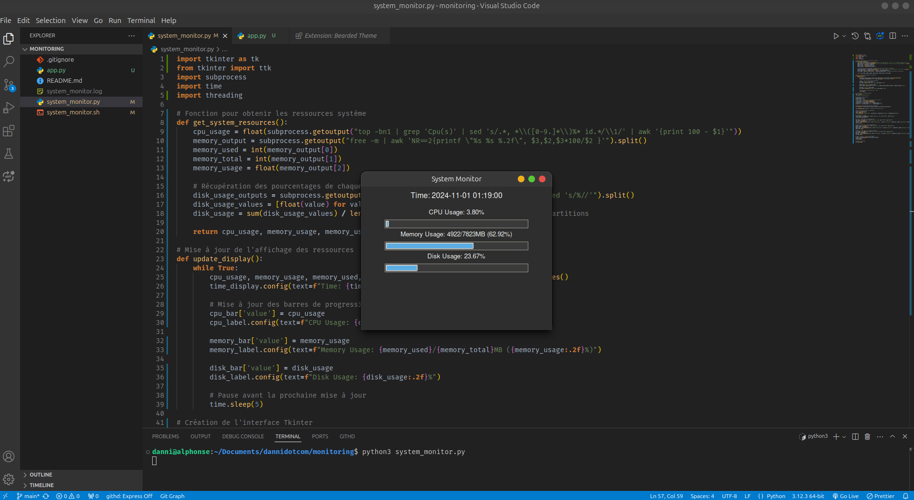

Ce script en shell permet de récupérer les informations clés sur les ressources du système (CPU, mémoire, espace disque) en temps réel.

```bash
#!/bin/bash

# Obtenir l'utilisation du CPU
cpu_usage() {
    top -bn1 | grep "Cpu(s)" | sed "s/.*, *\([0-9.]*\)%* id.*/\1/" | awk '{print 100 - $1"%"}'
}

# Obtenir l'utilisation de la mémoire
memory_usage() {
    free -m | awk 'NR==2{printf "Memory Usage: %s/%sMB (%.2f%%)\n", $3,$2,$3*100/$2 }'
}

# Obtenir l'utilisation de l'espace disque
disk_usage() {
    df -h | grep '^/dev/' | awk '{print "Disk Usage: "$5 " on "$1}'
}

# Afficher les résultats en temps réel
while true
do
    echo "CPU Usage: $(cpu_usage)"
    echo "$(memory_usage)"
    echo "$(disk_usage)"
    echo "----------------------------------"
    sleep 5  # Pause de 5 secondes avant la prochaine itération
done
```


Le script suivant en Python appelle le script shell, capture les résultats et les enregistre dans un fichier journal pour analyse ultérieure.

```python

import subprocess
import time

def log_system_resources(log_file):
    with open(log_file, 'a') as f:
        while True:
            # Appel du script shell pour obtenir les informations système
            cpu_usage = subprocess.getoutput("top -bn1 | grep 'Cpu(s)' | sed 's/.*, *\\([0-9.]*\\)%* id.*/\\1/' | awk '{print 100 - $1\"%\"}'")
            memory_usage = subprocess.getoutput("free -m | awk 'NR==2{printf \"Memory Usage: %s/%sMB (%.2f%%)\", $3,$2,$3*100/$2 }'")
            disk_usage = subprocess.getoutput("df -h | grep '^/dev/' | awk '{print \"Disk Usage: \"$5 \" on \"$1}'")

            # Formatage des données à enregistrer
            log_entry = f"Time: {time.strftime('%Y-%m-%d %H:%M:%S')}\n"
            log_entry += f"CPU Usage: {cpu_usage}\n"
            log_entry += f"{memory_usage}\n"
            log_entry += f"{disk_usage}\n"
            log_entry += "----------------------------------\n"

            # Enregistrement dans le fichier de log
            f.write(log_entry)
            print(log_entry)

            # Pause de 1 secondes avant la prochaine surveillance
            time.sleep(1)

# Lancer la surveillance et journalisation
if __name__ == "__main__":
    log_file_path = "system_monitor.log"
    log_system_resources(log_file_path)

```

Fonctionnement :
1. Le script shell récupère les informations système (CPU, mémoire, disque) en temps réel toutes les 5 secondes.
2. Le script Python exécute le script shell pour capturer les résultats et les enregistre dans un fichier de log (`system_monitor.log`).
3. Vous pouvez ajuster la durée de surveillance (via la fonction `time.sleep`) et la structure des logs selon vos besoins.

Pour exécuter :

1.  RendRE exécutable `system_monitor.sh` :
```bash
chmod +x system_monitor.sh
```

2. Lancez le script Python :
```python
python3 system_monitor.py
```

## Démonstration

Voici un aperçu de l'interface de surveillance en temps réel :

