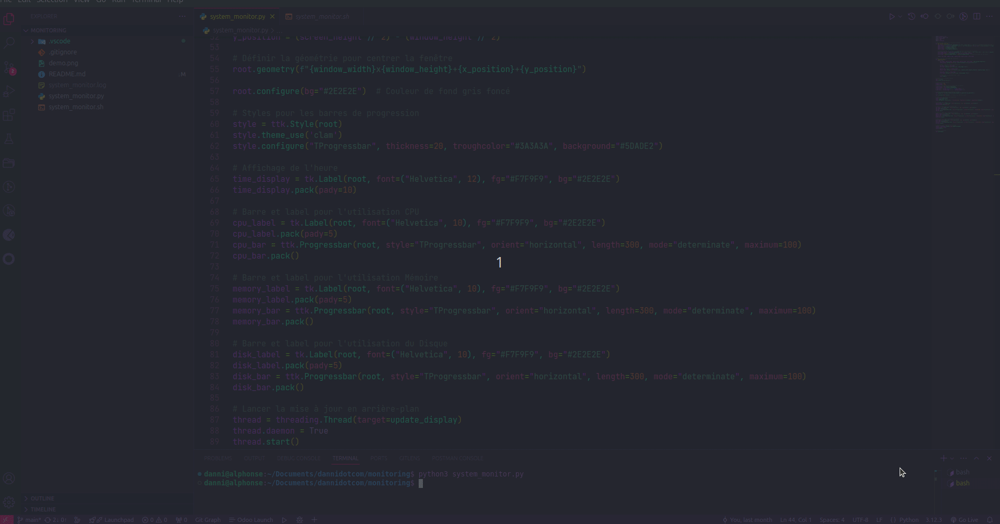

# Système de Surveillance

Ce projet permet de surveiller les ressources système (CPU, mémoire, espace disque) en temps réel et de journaliser les résultats pour analyse ultérieure.


```bash
#!/bin/bash

# Obtenir l'utilisation du CPU
cpu_usage() {
    top -bn1 | grep "Cpu(s)" | sed "s/.*, *\([0-9.]*\)%* id.*/\1/" | awk '{print 100 - $1"%"}'
}

# Obtenir l'utilisation de la mémoire
memory_usage() {
    free -m | awk 'NR==2{printf "Memory Usage: %s/%sMB (%.2f%%)\n", $3,$2,$3*100/$2 }'
}

# Obtenir l'utilisation de l'espace disque
disk_usage() {
    df -h | grep '^/dev/' | awk '{print "Disk Usage: "$5 " on "$1}'
}

# Afficher les résultats en temps réel
while true
do
    echo "CPU Usage: $(cpu_usage)"
    echo "$(memory_usage)"
    echo "$(disk_usage)"
    echo "----------------------------------"
    sleep 1  # Pause de 1 secondes avant la prochaine itération
done
```


Le script Python appelle le script shell, capture les résultats et les enregistre dans un fichier journal pour analyse ultérieure.

Pour exécuter :

1.  RendRE exécutable `system_monitor.sh` :
```bash
chmod +x system_monitor.sh
```

2. Lancez le script Python :
```python
python3 system_monitor.py
```

## Démonstration

Voici un aperçu de l'interface de surveillance en temps réel :


